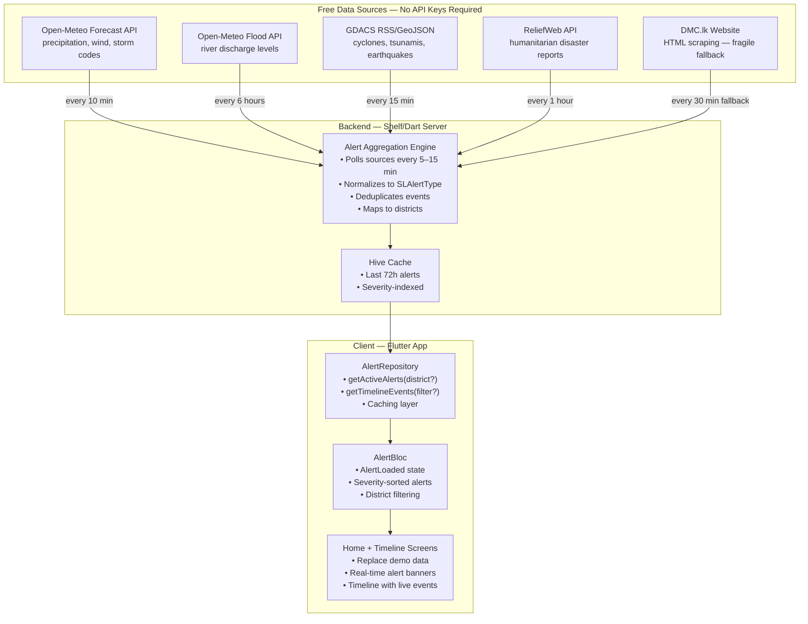
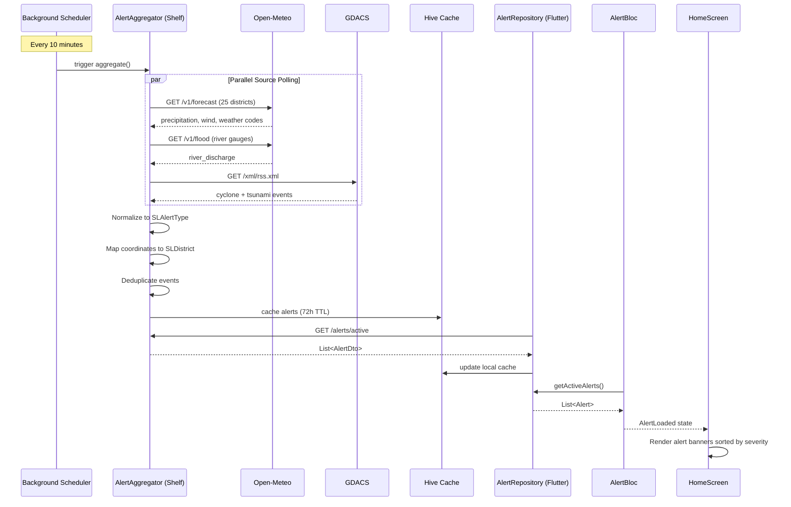

# DMC Alert Integration Plan — Real Sri Lanka Disaster Data Pipeline

**Date:** 2026-05-26  
**Status:** Architectural Design  
**Context:** Following Sri Lanka localization of all four screens

---

## 1. Problem Statement

Currently all alerts and timeline events are **hardcoded demo data** in [`_getDemoEvents()`](lib/presentation/screens/timeline/timeline_screen.dart:351) and [`_buildAlertSection()`](lib/presentation/screens/home/home_screen.dart:143). The app needs a real, multi-source alert pipeline that feeds DMC-style disaster data into the UI via the existing `Alert` and `TimelineEvent` entities.

**Key challenge:** The Sri Lanka Disaster Management Centre (DMC) has no public API. The solution must aggregate data from multiple free sources and derive alerts from weather thresholds.

---

## 2. Data Source Strategy

Since no single free API covers all DMC alert categories, we use a **layered aggregation** approach:



---

## 3. Source-by-Source Mapping to SLAlertType

| SLAlertType | Primary Source | Secondary Source | Detection Logic |
|-------------|---------------|------------------|-----------------|
| `flood` | Open-Meteo Flood API | Forecast precipitation > 50mm/6h | River discharge > 90th percentile OR precipitation threshold exceeded |
| `landslide` | Derived from precipitation + terrain | ReliefWeb | Rainfall > 100mm/24h in hilly districts (Ratnapura, Badulla, Nuwara Eliya, Kandy, Kegalle, Matale) |
| `cyclone` | GDACS | Open-Meteo wind speed | GDACS tropical cyclone event within 500km of SL coast OR wind > 60km/h sustained |
| `lightning` | Open-Meteo weather codes 95–99 | — | Thunderstorm codes in hourly forecast for any district |
| `coastalWarning` | Derived from wind + wave | GDACS | Wind > 40km/h on coastal districts OR GDACS coastal event |
| `tsunami` | GDACS | USGS earthquake feed | GDACS tsunami event in Indian Ocean OR M6.5+ earthquake in Indian Ocean |

---

## 4. Architecture — New Files Required

### 4.1 Domain Layer

#### NEW: [`lib/domain/repositories/alert_repository.dart`](lib/domain/repositories/alert_repository.dart)
```dart
abstract class AlertRepository {
  /// Get all currently active alerts, optionally filtered by district
  Future<List<Alert>> getActiveAlerts({SLDistrict? district});

  /// Get timeline events for the past 72 hours
  Future<List<TimelineEvent>> getTimelineEvents({
    SLDistrict? district,
    SLAlertType? typeFilter,
  });

  /// Get a single alert by ID
  Future<Alert?> getAlertById(String id);

  /// Cache validity check
  Future<bool> isCacheValid();

  /// Force refresh from backend
  Future<void> refreshAlerts();
}
```

#### MODIFY: [`lib/domain/entities/alert.dart`](lib/domain/entities/alert.dart)
Add helper getter for `SLAlertType`:
```dart
SLAlertType? get alertType => SLAlertType.fromString(type);
```

### 4.2 Data Layer

#### NEW: [`lib/data/remote/alerts/dmc_alert_client.dart`](lib/data/remote/alerts/dmc_alert_client.dart)
Client that talks to the backend alert aggregation endpoint:
```dart
class DmcAlertClient {
  final Dio _dio;

  Future<List<Alert>> fetchActiveAlerts({String? district});

  Future<List<TimelineEvent>> fetchTimeline({
    String? district,
    String? typeFilter,
  });
}
```

#### NEW: [`lib/data/repositories/alert_repository_impl.dart`](lib/data/repositories/alert_repository_impl.dart)
Implements `AlertRepository` with Hive caching:
```dart
class AlertRepositoryImpl implements AlertRepository {
  final DmcAlertClient _client;
  final HiveService _hiveService;

  // Cache TTL: 10 minutes for active alerts, 1 hour for timeline
  Future<List<Alert>> getActiveAlerts({SLDistrict? district}) async {
    if (await isCacheValid()) {
      final cached = _hiveService.getCachedAlerts();
      if (cached != null) return _filterByDistrict(cached, district);
    }
    final alerts = await _client.fetchActiveAlerts(district: district?.name);
    await _hiveService.cacheAlerts(alerts);
    return alerts;
  }
}
```

### 4.3 Presentation Layer

#### NEW: [`lib/presentation/blocs/alerts/alert_bloc.dart`](lib/presentation/blocs/alerts/alert_bloc.dart)
```dart
// States: AlertInitial, AlertLoading, AlertLoaded, AlertError
// Events: LoadAlerts, LoadTimeline, FilterByDistrict, RefreshAlerts

class AlertBloc extends Bloc<AlertEvent, AlertState> {
  final AlertRepository _alertRepository;
  // ...
}

class AlertLoaded extends AlertState {
  final List<Alert> activeAlerts;        // sorted by severity (critical first)
  final List<TimelineEvent> timelineEvents;
  final SLDistrict? selectedDistrict;
  final SLAlertType? typeFilter;
  final bool isStaleCache;
}
```

#### MODIFY: [`lib/presentation/screens/home/home_screen.dart`](lib/presentation/screens/home/home_screen.dart)
Replace hardcoded alert cards with `BlocBuilder<AlertBloc, AlertState>`:
```dart
BlocBuilder<AlertBloc, AlertState>(
  builder: (context, state) {
    if (state is AlertLoaded) {
      return ListView(
        children: state.activeAlerts.map((alert) =>
          _buildAlertInfoCard(alert)
        ).toList(),
      );
    }
    // ... loading/error states
  },
)
```

#### MODIFY: [`lib/presentation/screens/timeline/timeline_screen.dart`](lib/presentation/screens/timeline/timeline_screen.dart)
Replace `_getDemoEvents()` with `BlocBuilder<AlertBloc, AlertState>`:
```dart
// Remove _getDemoEvents() entirely
// Use state.timelineEvents from AlertLoaded state
```

### 4.4 Backend Layer

#### NEW: [`backend/lib/alerts/alert_aggregator.dart`](backend/lib/alerts/alert_aggregator.dart)
The core aggregation engine running on the Shelf server:
```dart
class AlertAggregator {
  final Dio _dio;

  // Polls all sources and returns normalized alerts
  Future<List<AlertDto>> aggregate() async {
    final results = await Future.wait([
      _fromOpenMeteoFlood(),
      _fromOpenMeteoPrecipitation(),
      _fromOpenMeteoThunderstorm(),
      _fromGdacs(),
      _fromReliefWeb(),
    ]);

    return _deduplicate(_normalize(results.expand((e) => e).toList()));
  }

  // Derive flood alerts from Open-Meteo thresholds
  Future<List<AlertDto>> _fromOpenMeteoPrecipitation() async { ... }

  // Derive landslide alerts from rainfall + terrain
  Future<List<AlertDto>> _fromLandslideRisk() async { ... }

  // Parse GDACS RSS for cyclone/tsunami
  Future<List<AlertDto>> _fromGdacs() async { ... }
}
```

#### NEW endpoints in [`backend/lib/server.dart`](backend/lib/server.dart):
```dart
router.get('/alerts/active', (Request request) async {
  final alerts = await aggregator.aggregate();
  return _jsonResponse(alerts);
});

router.get('/alerts/timeline', (Request request) async {
  final district = request.url.queryParameters['district'];
  final type = request.url.queryParameters['type'];
  final events = await aggregator.getTimeline(district: district, type: type);
  return _jsonResponse(events);
});
```

### 4.5 Dependency Injection

#### MODIFY: [`lib/core/di/injection.dart`](lib/core/di/injection.dart)
```dart
// New registrations:
final dmcAlertClient = DmcAlertClient();
getIt.registerSingleton<DmcAlertClient>(dmcAlertClient);

getIt.registerSingleton<AlertRepository>(
  AlertRepositoryImpl(
    client: getIt<DmcAlertClient>(),
    hiveService: getIt<HiveService>(),
  ),
);

getIt.registerFactory<AlertBloc>(
  () => AlertBloc(alertRepository: getIt<AlertRepository>()),
);
```

---

## 5. Alert Derivation Logic — Detailed

### 5.1 Flood Detection from Open-Meteo Forecast

Polls Open-Meteo every 10 minutes for each of the 25 district center coordinates. Triggers an alert when:

```
precipitation_6h > 50mm → WARNING alert
precipitation_24h > 100mm → EMERGENCY alert
precipitation_24h > 150mm → CRITICAL alert
```

Also queries Open-Meteo Flood API for river discharge. If discharge exceeds the 90th percentile of historical data → flood alert for downstream districts.

### 5.2 Landslide Detection

Computed from precipitation data combined with terrain knowledge (districts with elevation > 500m):

| District | Landslide Risk Threshold |
|----------|--------------------------|
| Ratnapura | > 100mm/24h → WARNING |
| Badulla | > 100mm/24h → WARNING |
| Nuwara Eliya | > 80mm/24h → WARNING |
| Kandy | > 100mm/24h → ADVISORY |
| Kegalle | > 100mm/24h → ADVISORY |
| Matale | > 80mm/24h → ADVISORY |

### 5.3 Cyclone Detection from GDACS

GDACS provides a free GeoJSON/RSS feed of tropical cyclones. The aggregator polls:
```
https://www.gdacs.org/xml/rss.xml
```
Filters for cyclones in the Bay of Bengal / Arabian Sea region and maps to affected Sri Lankan coastal districts based on projected track.

### 5.4 Lightning/Thunderstorm Detection

Straight from Open-Meteo weather codes 95–99 in the hourly forecast. If any district has thunderstorm forecast in the next 6 hours → `lightning` ADVISORY.

### 5.5 Coastal Warning

Derived: any coastal district with sustained wind > 40km/h OR wave height warning from Open-Meteo marine data → `coastalWarning` ADVISORY.

### 5.6 Tsunami

GDACS tsunami events filtered for Indian Ocean region. Any M6.5+ earthquake in the Indian Ocean (from USGS GeoJSON feed) also generates a precautionary tsunami bulletin.

---

## 6. Data Flow Sequence



---

## 7. Implementation Order

The work should proceed in this sequence:

| Step | What | Files |
|------|------|-------|
| 1 | Create `AlertDto` model + alert normalizer in backend | [`backend/lib/alerts/`](backend/lib/alerts/) |
| 2 | Build Open-Meteo precipitation-threshold alert derivation | [`alert_aggregator.dart`](backend/lib/alerts/) |
| 3 | Build GDACS RSS parser for cyclone/tsunami | [`alert_aggregator.dart`](backend/lib/alerts/) |
| 4 | Add `/alerts/active` and `/alerts/timeline` endpoints | [`server.dart`](backend/lib/server.dart) |
| 5 | Create `AlertRepository` interface and implementation in client | [`alert_repository.dart`](lib/domain/repositories/), [`alert_repository_impl.dart`](lib/data/repositories/) |
| 6 | Create `DmcAlertClient` for backend communication | [`dmc_alert_client.dart`](lib/data/remote/alerts/) |
| 7 | Create `AlertBloc` with full state management | [`alert_bloc.dart`](lib/presentation/blocs/alerts/) |
| 8 | Register in DI | [`injection.dart`](lib/core/di/injection.dart) |
| 9 | Wire `HomeScreen` to `AlertBloc` (replace demo alerts) | [`home_screen.dart`](lib/presentation/screens/home/) |
| 10 | Wire `TimelineScreen` to `AlertBloc` (replace demo events) | [`timeline_screen.dart`](lib/presentation/screens/timeline/) |
| 11 | End-to-end testing with real Open-Meteo data | — |

---

## 8. Backup / Degradation Strategy

Since the DMC has no public API and web scraping is fragile:

| Tier | What | When |
|------|------|------|
| **Tier 1 (Primary)** | Open-Meteo derived alerts (flood, landslide, lightning, coastal) + GDACS (cyclone, tsunami) | Always on, periodic polling |
| **Tier 2 (Fallback)** | ReliefWeb API humanitarian reports | If Tier 1 yields no events for 2+ hours |
| **Tier 3 (Graceful)** | Demo/mock data generator with `[SIMULATED]` badge | If all sources are unreachable |
| **Offline** | Last cached alerts from Hive (up to 72h old) | No connectivity |

---

## 9. Open Questions

| # | Question | Impact |
|---|----------|--------|
| 1 | Should alerts be polled client-side or pushed via WebSocket from the Shelf backend? | WebSocket is more real-time but adds complexity; polling every 10 min is simpler and matches weather refresh cadence |
| 2 | Should the backend cache alerts per-district or globally? | Per-district reduces response size; global is simpler. Recommend global with client-side filtering |
| 3 | Do we need Firebase Cloud Messaging for push alerts, or rely on in-app alerts only? | FCM enables background alerts; can be added in Phase 2 |
| 4 | Should the `AlertBloc` be provided at the app level (above ShellRoute) or per-screen? | App-level via `MultiBlocProvider` in `main.dart` so Home and Timeline share the same alert state |

---

## 10. Summary

- **No single free DMC API exists** — multi-source aggregation is the only viable approach
- **Primary sources:** Open-Meteo (threshold-derived + Flood API) + GDACS RSS
- **7 new files, 4 modified files** across backend and client
- **All sources are free and require no API keys**
- **Fallback chain:** derived alerts → ReliefWeb → simulated → cached offline
- **Caching:** 10-min TTL active alerts, 1-hour timeline, 72-hour max history