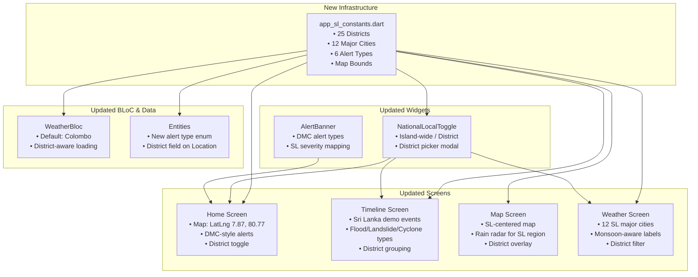
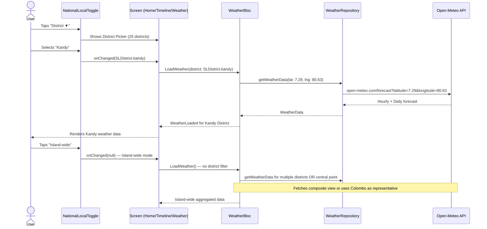

# Sri Lanka Localization Plan — NERV Disaster Prevention App

**Date:** 2026-05-26  
**Target:** All four main screens (Home, Timeline, Map, Weather) plus supporting infrastructure  

---

## 1. Summary of Changes

The app currently mirrors Japan's NERV app with Japanese city names, earthquake-centric alerts, and Japan-centric map coordinates. This plan transforms the app for **Sri Lanka** — replacing all hardcoded Japan references with Sri Lanka-specific data, alert types, city lists, and district-based navigation.

---

## 2. Architecture Overview



---

## 3. File-by-File Changes

### 3.1 NEW FILE: [`lib/core/constants/app_sl_constants.dart`](lib/core/constants/app_sl_constants.dart)

A dedicated constants file containing all Sri Lanka-specific data structures:

**Contents:**

```dart
// Sri Lanka Map Bounds
static const LatLng slCenter = LatLng(7.8731, 80.7718);  // near Dambulla
static const LatLng slSouthWest = LatLng(5.9167, 79.5333);
static const LatLng slNorthEast = LatLng(9.8167, 81.8167);
static const double slInitialZoom = 7.2;

// 25 Districts
enum SLDistrict { ... }  // with displayName, lat, lng, province

// 6 Disaster Alert Types (matching DMC Sri Lanka categories)
enum SLAlertType {
  flood, landslide, cyclone, lightning, coastalWarning, tsunami;
  // each has: label, icon, severity color, description
}

// 12 Major Cities for Weather Screen
static const List<SLCity> slMajorCities = [
  SLCity('Colombo', 6.9271, 79.8612, SLDistrict.colombo),
  SLCity('Kandy', 7.2906, 80.6337, SLDistrict.kandy),
  SLCity('Galle', 6.0535, 80.2210, SLDistrict.galle),
  SLCity('Jaffna', 9.6683, 80.0074, SLDistrict.jaffna),
  SLCity('Batticaloa', 7.7167, 81.7000, SLDistrict.batticaloa),
  SLCity('Trincomalee', 8.5874, 81.2152, SLDistrict.trincomalee),
  SLCity('Anuradhapura', 8.3114, 80.4037, SLDistrict.anuradhapura),
  SLCity('Ratnapura', 6.6828, 80.3994, SLDistrict.ratnapura),
  SLCity('Badulla', 6.9897, 81.0557, SLDistrict.badulla),
  SLCity('Kurunegala', 7.4875, 80.3647, SLDistrict.kurunegala),
  SLCity('Matara', 5.9485, 80.5353, SLDistrict.matara),
  SLCity('Hambantota', 6.1241, 81.1185, SLDistrict.hambantota),
];

// Province groupings for national-level weather summaries
static const Map<String, List<SLDistrict>> provinces;
```

---

### 3.2 UPDATE: [`lib/presentation/screens/home/home_screen.dart`](lib/presentation/screens/home/home_screen.dart)

| Current (Japan) | Change (Sri Lanka) |
|---|---|
| `initialCenter: LatLng(36.0, 138.0)` | `LatLng(7.87, 80.77)` |
| `initialZoom: 5` | `7.2` (Sri Lanka needs tighter zoom) |
| Map `minZoom: 3` | `6` |
| Alert card: "Off. Ibaraki (Int. 1)" | DMC-style alert: "Colombo District — Flood Warning (Level 3)" |
| Alert card icon: `Icons.public` (globe) | Dynamic icon based on alert type (flood/landslide/cyclone) |
| Supporter banner: "Join as a Supporter" | **Keep or replace** with local equivalent if needed |
| Section header: "National" / "Local" | "Island-wide" / "[District Name]" |

**Key logic changes:**
- Alert section should display Sri Lanka disaster categories
- Map bounds should constrain to Sri Lanka region (`fitBounds` with SW/NE coords)
- `_isNational` state needs to tie into selected district

---

### 3.3 UPDATE: [`lib/presentation/screens/timeline/timeline_screen.dart`](lib/presentation/screens/timeline/timeline_screen.dart)

| Current (Japan) | Change (Sri Lanka) |
|---|---|
| `_getDemoEvents()` — all earthquake events in Japanese locations | Replace with Sri Lanka-specific demo events |
| Event types: `earthquake`, `tsunami`, `weather`, `volcano`, `j-alert` | `flood`, `landslide`, `cyclone`, `lightning`, `coastal`, `tsunami`, `earthquake`, `info` |
| `_getEventTypeLabel()` — "Earthquake Info", "Tsunami Warning", "J-Alert" | "Flood Warning", "Landslide Alert", "Cyclone Advisory", "Lightning Alert", "Coastal Warning", "Tsunami Bulletin" |
| Event locations: Off. Ibaraki, Off. Iwate, Off. Miyagi, Kagoshima... | Colombo, Galle, Ratnapura, Badulla, Batticaloa, Jaffna... |
| `_getEventIcon()` — `Icons.public`, `Icons.waves`, `Icons.landscape`, `Icons.campaign` | `Icons.water` (flood), `Icons.terrain` (landslide), `Icons.cyclone` (cyclone), `Icons.bolt` (lightning), `Icons.beach_access` (coastal), `Icons.waves` (tsunami) |

**New demo events for Sri Lanka:**

| # | Type | Title | District | Severity |
|---|---|---|---|---|
| 1 | flood | Colombo District — Flood Warning | Colombo | warning |
| 2 | landslide | Ratnapura — Landslide Alert | Ratnapura | emergency |
| 3 | cyclone | Eastern Coast — Cyclone Advisory | Batticaloa | advisory |
| 4 | lightning | Central Highlands — Lightning Alert | Badulla | warning |
| 5 | coastal | Southern Coast — Coastal Warning | Galle | advisory |
| 6 | flood | Kalutara River Basin — Flood Watch | Kalutara | info |
| 7 | landslide | Nuwara Eliya — Landslide Watch | Nuwara Eliya | advisory |
| 8 | flood | Gampaha District — Flood Warning LIFTED | Gampaha | info (isLifted: true) |
| 9 | tsunami | Sri Lanka Coast — Tsunami Bulletin | All Coastal | critical |

---

### 3.4 UPDATE: [`lib/presentation/screens/map/map_screen.dart`](lib/presentation/screens/map/map_screen.dart)

| Current (Japan) | Change (Sri Lanka) |
|---|---|
| `_currentCenter: LatLng(36.0, 138.0)` | `LatLng(7.87, 80.77)` |
| `_currentZoom: 5.0` | `7.2` |
| `minZoom: 3` | `6` |
| Title: "Rain Radar" | "Rain Radar — Sri Lanka" |
| Rainviewer API — uses global data, should filter to SL region | Configure `fitBounds` to SL extent |
| No district/hazard overlay | Add hazard zone overlay layer placeholder |

**Additional considerations:**
- Map controls should include a "zoom to Sri Lanka" home button
- Layer chips at bottom can include SL-specific options like "Flood Zones", "Landslide Risk"

---

### 3.5 UPDATE: [`lib/presentation/screens/weather/weather_screen.dart`](lib/presentation/screens/weather/weather_screen.dart)

| Current (Japan) | Change (Sri Lanka) |
|---|---|
| `initialCenter: LatLng(36.0, 138.0)` | `LatLng(7.87, 80.77)` |
| `initialZoom: 5` | `7.2` |
| `_getCityData()` — 14 Japanese cities | 12 Sri Lankan cities (see list above) |
| "National Weather" / "Local Weather" header | "Island-wide Weather" / "[District] Weather" |
| Date format with `　` (full-width space) | Standard English date format `yyyy/MM/dd (EEE)` — no full-width characters |

**City data for `_getCityData()`:**
Replace all `_CityWeather` entries with the 12 Sri Lankan cities from `app_sl_constants.dart`. Each should ideally pull real temperature data from the Open-Meteo API (grouped by closest grid point), or fall back to Colombo actual data with regional offsets for other cities.

---

### 3.6 UPDATE: [`lib/presentation/widgets/national_local_toggle.dart`](lib/presentation/widgets/national_local_toggle.dart)

| Current | Change |
|---|---|
| Labels: "National" / "Local" | "Island-wide" / "District" |
| "Local" simply toggles boolean | "District" should open a district picker (bottom sheet or dropdown) |
| Add button (`+`) adds a custom location | Add button opens district selection modal |

**New behavior:**
```
┌──────────────────────────────────────────────┐
│    [ Island-wide ]  |  [ District ▼ ]  [+]   │
└──────────────────────────────────────────────┘
     ↑ selected          ↑ tap → district picker
```

When "District" is selected, a modal/bottom sheet lists all 25 districts alphabetically. The selected district persists in state.

---

### 3.7 UPDATE: [`lib/presentation/blocs/weather/weather_bloc.dart`](lib/presentation/blocs/weather/weather_bloc.dart)

| Current | Change |
|---|---|
| Default: Colombo at `6.9271, 79.8612` | **Already correct!** Keep as-is |
| No district awareness | Add `selectedDistrict` to state or events |
| `LoadWeather` fetches for one location | Optionally support district-array fetch for Island-wide view |

**Proposed state addition:**
```dart
class WeatherState {
  final SLDistrict? selectedDistrict;  // null = Island-wide
  // ...existing fields
}
```

---

### 3.8 UPDATE: [`lib/presentation/screens/settings/settings_screen.dart`](lib/presentation/screens/settings/settings_screen.dart)

| Current | Change |
|---|---|
| Notification categories: Critical Alerts, Earthquake, Tsunami, Weather Warning, Hazard Level, J-Alert | Replace with: Critical Alerts, Flood, Landslide, Cyclone, Lightning, Coastal Warning, Tsunami |
| Language: `EN ● │ JA ○` | Change to `EN ● │ SI ○ │ TA ○` (English, Sinhala, Tamil) |
| No district preference | Add "Default District" picker |

---

### 3.9 UPDATE: Entity Files

**`lib/domain/entities/alert.dart`:**
- Type field currently a free `String`. Add an `SLAlertType` enum or documented string constants for the six DMC categories.
- Keep type as `String` for flexibility, but add a getter for `SLAlertType` parsing.

**`lib/domain/entities/timeline_event.dart`:**
- Same as Alert — ensure type string values align with the six DMC categories.
- No structural changes needed; entity already supports all needed fields.

**`lib/domain/entities/location.dart`:**
- Optionally add `district` field so the Location entity can carry district metadata.
- Add `bool get isSLDistrict` convenience getter.

---

### 3.10 UPDATE: [`lib/data/repositories/weather_repository_impl.dart`](lib/presentation/blocs/weather/weather_bloc.dart)

- The default location fallback is already Colombo, Sri Lanka — no changes needed.

---

### 3.11 OPTIONAL: Backend [`backend/lib/server.dart`](backend/lib/server.dart)

If the backend proxies weather data, ensure it handles Sri Lanka coordinates and Open-Meteo calls with appropriate `timezone=Asia/Colombo`.

---

## 4. Data Flow: Island-wide vs District View



---

## 5. The 25 Districts of Sri Lanka

For the district picker and data models:

| # | District | Province | Lat | Lng | Key Hazard |
|---|----------|----------|-----|-----|------------|
| 1 | Colombo | Western | 6.9271 | 79.8612 | Flood |
| 2 | Gampaha | Western | 7.0867 | 80.0128 | Flood |
| 3 | Kalutara | Western | 6.5854 | 79.9607 | Flood, Landslide |
| 4 | Kandy | Central | 7.2906 | 80.6337 | Landslide |
| 5 | Matale | Central | 7.4675 | 80.6234 | Landslide |
| 6 | Nuwara Eliya | Central | 6.9497 | 80.7891 | Landslide |
| 7 | Galle | Southern | 6.0535 | 80.2210 | Coastal, Flood |
| 8 | Matara | Southern | 5.9485 | 80.5353 | Coastal, Flood |
| 9 | Hambantota | Southern | 6.1241 | 81.1185 | Coastal, Cyclone |
| 10 | Jaffna | Northern | 9.6683 | 80.0074 | Cyclone, Coastal |
| 11 | Kilinochchi | Northern | 9.3929 | 80.4041 | Flood |
| 12 | Mannar | Northern | 8.9802 | 79.9043 | Coastal, Cyclone |
| 13 | Vavuniya | Northern | 8.7577 | 80.4993 | Flood |
| 14 | Mullaitivu | Northern | 9.2670 | 80.8140 | Coastal, Cyclone |
| 15 | Batticaloa | Eastern | 7.7167 | 81.7000 | Cyclone, Coastal |
| 16 | Ampara | Eastern | 7.2833 | 81.6667 | Flood, Coastal |
| 17 | Trincomalee | Eastern | 8.5874 | 81.2152 | Cyclone, Coastal |
| 18 | Kurunegala | North Western | 7.4875 | 80.3647 | Flood |
| 19 | Puttalam | North Western | 8.0362 | 79.8287 | Coastal |
| 20 | Anuradhapura | North Central | 8.3114 | 80.4037 | Drought, Lightning |
| 21 | Polonnaruwa | North Central | 7.9403 | 81.0188 | Flood, Lightning |
| 22 | Badulla | Uva | 6.9897 | 81.0557 | Landslide |
| 23 | Monaragala | Uva | 6.8728 | 81.3507 | Lightning, Flood |
| 24 | Ratnapura | Sabaragamuwa | 6.6828 | 80.3994 | Landslide, Flood |
| 25 | Kegalle | Sabaragamuwa | 7.2539 | 80.3535 | Landslide |

---

## 6. Alert Type Mapping (DMC Sri Lanka → Severity)

| DMC Alert Type | Icon | Severity Mapping |
|---------------|------|-----------------|
| Flood Warning | `Icons.water` | Emergency → Warning → Advisory (based on level) |
| Landslide Alert | `Icons.terrain` | Emergency → Warning → Advisory |
| Cyclone Advisory | `Icons.cyclone` | Critical → Emergency → Warning |
| Lightning Alert | `Icons.bolt` | Warning → Advisory |
| Coastal Warning | `Icons.beach_access` | Warning → Advisory → Info |
| Tsunami Bulletin | `Icons.waves` | Critical → Emergency |

---

## 7. Implementation Order (Recommended)

The work should proceed in this sequence to minimize cascading breakage:

1. **Create `app_sl_constants.dart`** — foundational data needed by everything else
2. **Update entity files** — add district field and alert type constants
3. **Update `NationalLocalToggle`** — widget used by multiple screens
4. **Update `HomeScreen`** — map center, alert types, incoapporate toggle
5. **Update `TimelineScreen`** — demo events, event types, icons
6. **Update `MapScreen`** — map center, title, region bounds
7. **Update `WeatherScreen`** — cities, map center, date format
8. **Update `WeatherBloc`** — district-aware loading
9. **Update `SettingsScreen`** — notification categories, language options
10. **Testing & validation**

---

## 8. Risks & Considerations

| Risk | Mitigation |
|------|------------|
| Open-Meteo API resolution may be coarse for small Sri Lankan districts | Use the API's native ~11km grid; fall back to nearest grid point |
| Some Material Icons may not render well on all devices | Use `Icons.water_drop` as fallback for flood, `Icons.landslide` may not exist → use `Icons.terrain` |
| The app currently has no real alert data source for Sri Lanka | Start with demo data; document integration points for DMC API |
| Sinhala/Tamil localization is scoped as future work | Add language enum placeholders now; actual translations later |

---

## 9. Expected Outcome

After all changes are implemented:
- **Home Screen:** Map centered on Sri Lanka, shows DMC-style alert banners, toggle reads "Island-wide / District"
- **Timeline Screen:** Events are Sri Lanka disasters (floods, landslides, cyclones) with appropriate icons and locations
- **Map Screen:** Rain radar overlay over Sri Lanka region, appropriate zoom bounds
- **Weather Screen:** 12 major Sri Lankan cities with weather data, map focused on Sri Lanka
- **Settings Screen:** DMC-relevant notification categories, language options for EN/SI/TA